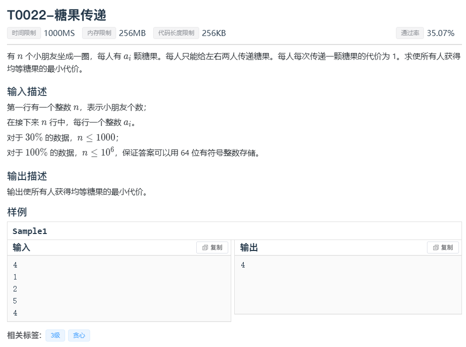

## 第一题


```c++
//
// Created by KingQAQuuu on 2023/11/13.
//
#include "bits/stdc++.h"
//每次都找最小的合并
using namespace std;
priority_queue<long long,vector<long long>,greater<long long> >pq1;
int main(){
    int n;
    long long power=0;
    scanf("%d",&n);
    if(n==1){
        long long x;
        cin>>x;
        cout<<x;
    }
    else{
        long long x;
        for (int i = 0; i < n; ++i) {
            cin>>x;
            pq1.push(x);
        }
        long long a,b;
        for (int i = 0; i < n-1; ++i) {
            a=pq1.top();
            pq1.pop();
            b=pq1.top();
            pq1.pop();
            power+=a+b;
            pq1.push(a+b);
        }
      cout<<power;

    }
}
```

------

## 第二题


```c++
//
// Created by KingQAQuuu on 2023/11/13.
//
#include "bits/stdc++.h"
using namespace std;
struct node{
    int deadline;
    int cutMoney;
};
int visted[501];
node xiaozhi[501];

int cmp(const node &a,const node &b){
    return a.cutMoney>b.cutMoney;
}
int main(){
    int m,n;
    scanf("%d %d",&m,&n);
    for (int i = 1; i <= n; ++i) {
        scanf("%d",&xiaozhi[i].deadline);
    }
    for (int i = 1; i <= n; ++i) {
        scanf("%d",&xiaozhi[i].cutMoney);
    }
    sort(xiaozhi+1,xiaozhi+1+n,cmp);
    int ans=0;
    for (int i = 1; i <= n; ++i) {
        int flag = 0;
        for (int j = xiaozhi[i].deadline; j ; j--) {
            if (visted[j]==0){
                visted[j]=1;
                flag=1;
                break;
            }
        }
        if (flag==0){
            for (int j = n; j  ; j--) {
                if (visted[j]==0){
                    visted[j]=1;
                    break;
                }
            }
            ans+=xiaozhi[i].cutMoney;
        }
    }
    printf("%d\n",m-ans);
    return 0;
}
```

------

## 第三题



```

```

