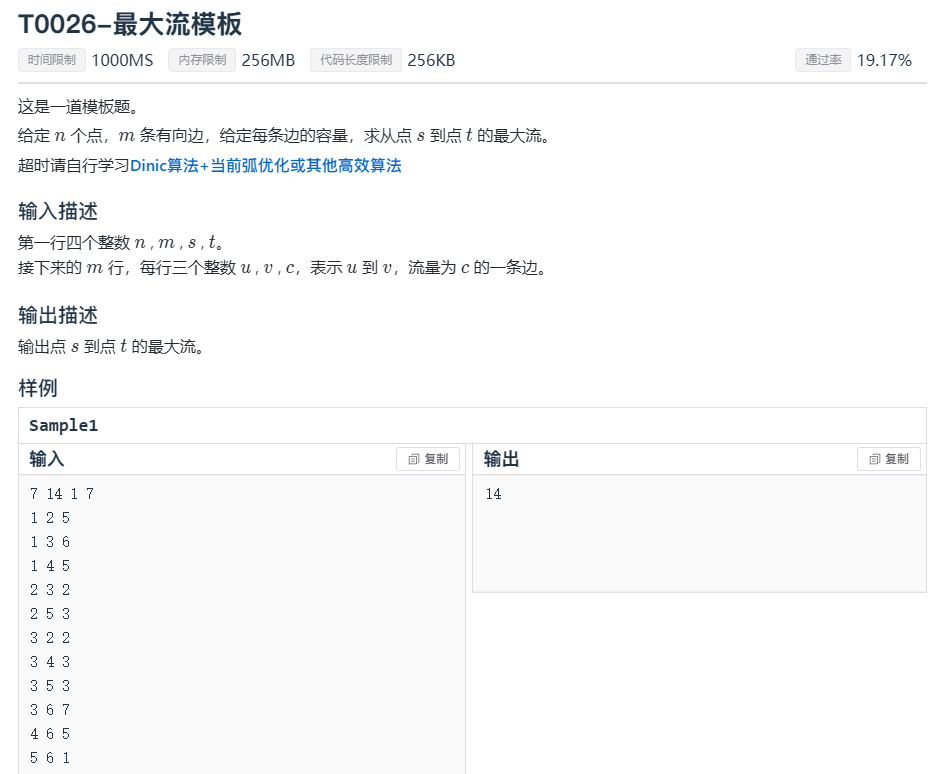
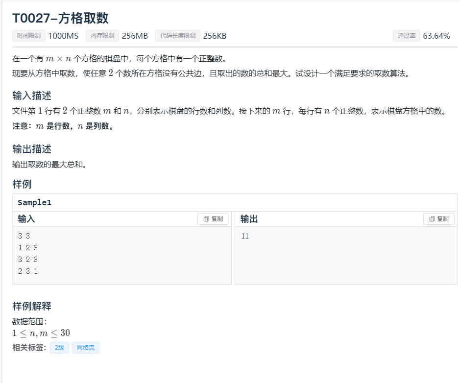

### 具体实现模板代码可查看[网络最大流算法模板（EK+Dinic+Isap+Hlpp） - 知乎 (zhihu.com)](https://zhuanlan.zhihu.com/p/356840694)

## 第一题




```c++
//
// Created by KingQAQuuu on 2023/11/20.
//
#include"bits/stdc++.h"
#define INF  2147483467
using namespace std;
using ll = long long;

const int maxn = 520010, maxm = 520010;
int n, m, s, t;

struct Edge{
    ll to, next, weight;
};
Edge edges[maxm];
int edge_cnt = 1, head[maxn], cur[maxn];

void add(int x,int y,int w){
    edges[++edge_cnt].next = head[x];
    edges[edge_cnt].to = y;
    edges[edge_cnt].weight = w;
    head[x] = edge_cnt;
}

int level[maxn];
bool bfs(){
    memset(level, 0, sizeof(level));
    memcpy(cur, head, sizeof(head));
    queue<int> q;
    q.push(s);
    level[s] = 1;
    while (!q.empty()){
        int u = q.front();
        q.pop();
        for (int i = head[u]; i != 0; i = edges[i].next){
            ll v = edges[i].to, flow = edges[i].weight;
            if (flow > 0 && level[v] == 0){
                level[v] = level[u] + 1;
                q.push(v);
            }
        }
    }
    return (level[t] != 0);
}

int dfs(int p = s, int cur_flow = INF){
    if (p == t) return cur_flow;
    ll ret = 0;
    for (int i = cur[p]; i != 0; i = edges[i].next){
        cur[p] = i;
        ll v = edges[i].to, vol = edges[i].weight;
        if (level[v] == level[p] + 1 && vol > 0){
            int f = dfs(v, min(cur_flow - ret, vol));
            edges[i].weight -= f;
            edges[i^1].weight += f;
            ret += f;
            if (ret == cur_flow) return ret;
        }
    }
    return ret;
}

ll dinic(){
    ll max_flow = 0;
    while (bfs()){
        max_flow += dfs();
    }
    return max_flow;
}

int main(){
    scanf("%d %d %d %d", &n, &m, &s, &t);
    for (int i = 1; i <= m ; ++i){
        int x, y, w;
        scanf("%d %d %d", &x, &y, &w);
        add(x, y, w);
        add(y, x, 0);
    }
    printf("%lld", dinic());
    return 0;
}
```


------

## 第二题



```c++

```

