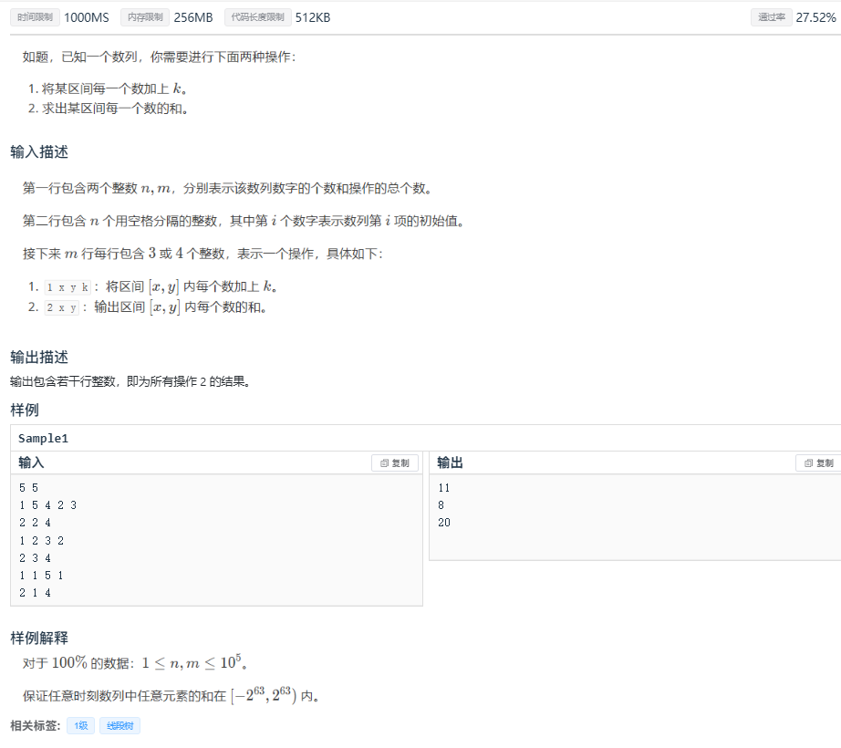
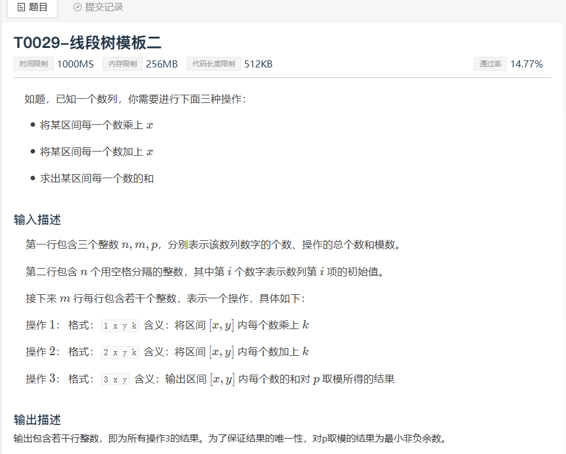

## 讲解可查看[211【模板】线段树+懒标记 Luogu P3372 线段树 1_哔哩哔哩_bilibili](https://www.bilibili.com/video/BV1G34y1L7b3/?spm_id_from=333.1007.top_right_bar_window_history.content.click&vd_source=855886c2979d9ced3bf90ec5b4184ec9)&&[212 线段树 区间乘加_哔哩哔哩_bilibili](https://www.bilibili.com/video/BV1cN4y1d7fR/?spm_id_from=333.999.0.0&vd_source=855886c2979d9ced3bf90ec5b4184ec9)

## 第一题



```c++
//
// Created by KingQAQuuu on 2023/11/27.
//
#include "bits/stdc++.h"
using namespace std;
#define MAXN 1000001
#define ll long long
using namespace std;
unsigned ll n,m,a[MAXN],ans[MAXN<<2],tag[MAXN<<2];
inline ll ls(ll x)
{
    return x<<1;
}
inline ll rs(ll x)
{
    return x<<1|1;
}
void scan()
{
    cin>>n>>m;
    for(ll i=1;i<=n;i++)
        scanf("%lld",&a[i]);
}
inline void push_up(ll p)
{
    ans[p]=ans[ls(p)]+ans[rs(p)];
}
void build(ll p,ll l,ll r)
{
    tag[p]=0;
    if(l==r){ans[p]=a[l];return ;}
    ll mid=(l+r)>>1;
    build(ls(p),l,mid);
    build(rs(p),mid+1,r);
    push_up(p);
}
inline void f(ll p,ll l,ll r,ll k)
{
    tag[p]=tag[p]+k;
    ans[p]=ans[p]+k*(r-l+1);
}
inline void push_down(ll p,ll l,ll r)
{
    ll mid=(l+r)>>1;
    f(ls(p),l,mid,tag[p]);
    f(rs(p),mid+1,r,tag[p]);
    tag[p]=0;
}
inline void update(ll nl,ll nr,ll l,ll r,ll p,ll k)
{
    if(nl<=l&&r<=nr)
    {
        ans[p]+=k*(r-l+1);
        tag[p]+=k;
        return ;
    }
    push_down(p,l,r);
    ll mid=(l+r)>>1;
    if(nl<=mid)update(nl,nr,l,mid,ls(p),k);
    if(nr>mid) update(nl,nr,mid+1,r,rs(p),k);
    push_up(p);
}
ll query(ll q_x,ll q_y,ll l,ll r,ll p)
{
    ll res=0;
    if(q_x<=l&&r<=q_y)return ans[p];
    ll mid=(l+r)>>1;
    push_down(p,l,r);
    if(q_x<=mid)res+=query(q_x,q_y,l,mid,ls(p));
    if(q_y>mid) res+=query(q_x,q_y,mid+1,r,rs(p));
    return res;
}
int main()
{
    ll a1,b,c,d,e,f;
    scan();
    build(1,1,n);
    while(m--)
    {
        scanf("%lld",&a1);
        switch(a1)
        {
            case 1:{
                scanf("%lld%lld%lld",&b,&c,&d);
                update(b,c,1,n,1,d);
                break;
            }
            case 2:{
                scanf("%lld%lld",&e,&f);
                printf("%lld\n",query(e,f,1,n,1));
                break;
            }
        }
    }
    return 0;
}
```

```c++
//
// Created by KingQAQuuu on 2023/12/1.
//
#include "bits/stdc++.h"
using namespace std;
#define ll long long
#define lc p<<1
#define rc p<<1|1
#define MAXN 1000001
struct Tree{
    ll l,r,sum,add;
}tr[MAXN*4];
ll n,m,a[MAXN];
void scan()
{
    cin>>n>>m;
    for(ll i=1;i<=n;i++)
        scanf("%lld",&a[i]);
}
void pushup(ll p){//向上更新
    tr[p].sum=tr[lc].sum+tr[rc].sum;
}
void pushdown(ll p){//向下更新
    if(tr[p].add){
        tr[lc].sum+=tr[p].add*(tr[lc].r-tr[lc].l+1);
        tr[rc].sum+=tr[p].add*(tr[rc].r-tr[lc].l+1);
        tr[lc].add+=tr[p].add;
        tr[rc].add+=tr[p].add;
        tr[p].add=0;
    }
}
void build(ll p,ll l,ll r){
    tr[p]={l,r,a[l],0};
    if(l==r) {//是叶子就返回
        return;
    }
    ll m=l+r>>1;//不是叶子就裂开
    build(lc,l,m);
    build(rc,m+1,r);
    pushup(p);
}
void update(ll p,ll x,ll y,ll k){
    if(x<=tr[p].l&&y>=tr[p].r){//覆盖则修改
        tr[p].sum+=(tr[p].r-tr[p].l+1)*k;
        tr[p].add+=k;
        return;
    }
    ll m=tr[p].l+tr[p].r>>1;//不覆盖则裂开
    pushdown(p);
    if(x<=m){
        update(lc,x,y,k);
    }
    if(y>m){
        update(rc,x,y,k);
    }
    pushup(p);
}
ll query(ll p,ll x,ll y){
    if(x<=tr[p].l&&y>=tr[p].r){
        return tr[p].sum;
    }
    ll m=tr[p].l+tr[p].r>>1;//不覆盖则裂开
    pushdown(p);
    ll sum = 0;
    if(x<=m){
        sum+= query(lc,x,y);
    }
    if(y>m){
        sum+= query(rc,x,y);
    }
    return sum;
}
int main(){
    ll a1,b,c,d,e,f;
    scan();
    build(1,1,n);
    while(m--){
        scanf("%lld",&a1);
        switch(a1)
        {
            case 1:{
                scanf("%lld%lld%lld",&b,&c,&d);
                update(1,b,c,d);
                break;
            }
            case 2:{
                scanf("%lld%lld",&e,&f);
                printf("%lld\n",query(1,e,f));
                break;
            }
        }
    }
    return 0;
}
```


------

## 第二题




```c++
//
// Created by KingQAQuuu on 2023/12/1.
//
#include "bits/stdc++.h"
using namespace std;
#define ll long long
#define lc u<<1
#define rc u<<1|1
#define MAXN 1000001
struct Tree{
    ll l,r,sum,mul ,add;
}tr[MAXN*4];
ll n,m,p,a[MAXN];
void update(ll u) {
    tr[u].sum = (tr[lc].sum + tr[rc].sum) % p;
    return;
}
void scan()
{
    cin>>n>>m>>p;
    for(ll i=1;i<=n;i++)
        scanf("%lld",&a[i]);
}
void pushup(ll u){//向上更新
    tr[u].sum=(tr[lc].sum+tr[rc].sum)%p;
}
void build(ll u,ll l,ll r){
    tr[u]={l,r,a[l],1,0};
    if(l==r) {//是叶子就返回
        tr[u].sum=a[l]%p;
        return;
    }
    ll m=l+r>>1;//不是叶子就裂开
    build(lc,l,m);
    build(rc,m+1,r);
    pushup(u);
    return;
}
void pushdown(ll u){//向下更新
    tr[lc].sum = (tr[lc].sum * tr[u].mul + tr[u].add * (tr[lc].r - tr[lc].l + 1)) % p;
    tr[rc].sum = (tr[rc].sum * tr[u].mul + tr[u].add * (tr[rc].r - tr[rc].l + 1)) % p;

    tr[lc].mul = (tr[lc].mul * tr[u].mul) % p;
    tr[rc].mul = (tr[rc].mul * tr[u].mul) % p;

    tr[lc].add = (tr[lc].add * tr[u].mul + tr[u].add) % p;
    tr[rc].add = (tr[rc].add * tr[u].mul + tr[u].add) % p;

    tr[u].add = 0;
    tr[u].mul = 1;
    return;
}
void ChangeMul(ll u, ll x, ll y, ll k) { //区间乘法
    if (x <= tr[u].l && tr[u].r <= y) {
        tr[u].add = (tr[u].add * k) % p;
        tr[u].mul = (tr[u].mul * k) % p;
        tr[u].sum = (tr[u].sum * k) % p;
        return;
    }

    pushdown(u);
    int mid = (tr[u].l + tr[u].r) >> 1;
    if (x <= mid) ChangeMul(lc, x, y, k);
    if (y > mid) ChangeMul(rc, x, y, k);
    update(u);
    return;
}

void ChangeAdd(ll u, ll x, ll y, ll k) { //区间加法
    if (x <= tr[u].l && tr[u].r <= y) {
        tr[u].add = (tr[u].add + k) % p;
        tr[u].sum = (tr[u].sum + k * (tr[u].r - tr[u].l + 1)) % p;
        return;
    }

    pushdown(u);
    ll mid = (tr[u].l + tr[u].r) >> 1;
    if (x <= mid) ChangeAdd(lc, x, y, k);
    if (y > mid) ChangeAdd(rc, x, y, k);
    update(u);
    return;
}
ll AskRange(ll u, ll x, ll y) { //区间询问
    if (x <= tr[u].l && tr[u].r <= y) {
        return tr[u].sum;
    }

    pushdown(u);
    ll val = 0;
    ll mid = (tr[u].l + tr[u].r) >> 1;
    if (x <= mid) val = (val + AskRange(lc, x, y)) % p;
    if (y > mid) val = (val + AskRange(rc, x, y)) % p;
    return val;
}
int main(){
    ll op,x,y;
    scan();
    build(1,1,n);
    for (int i = 1; i <= m; i++){
        scanf("%lld%lld%lld",&op,&x,&y);
        if (op == 1) {
            ll k;
            scanf("%lld", &k);
            ChangeMul(1, x, y, k);
        }
        if (op == 2) {
            ll k;
            scanf("%lld", &k);
            ChangeAdd(1, x, y, k);
        }
        if (op == 3) {
            printf("%lld\n", AskRange(1, x, y));
        }
    }
    return 0;
}
```

