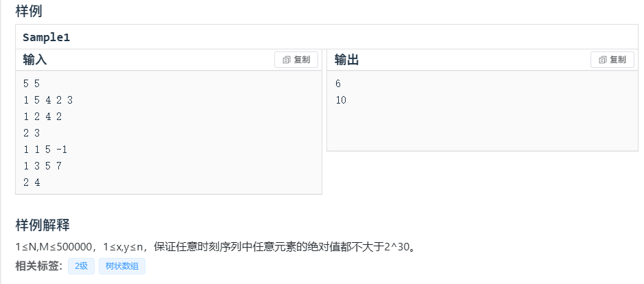

## 第一题


```c++
//
// Created by KingQAQuuu on 2023/12/1.
//
#include "bits/stdc++.h"
using namespace std;
#define ll long long
#define MAXN 1000001
ll n,m,tree[MAXN*4];
int lowbit(ll k){
    return k&-k;
}
void add(ll x,ll k){
    while(x<=n){
        tree[x]+=k;
        x+= lowbit(x);
    }
}
ll sum(ll x){
    ll ans=0;
    while(x!=0){
        ans+=tree[x];
        x-= lowbit(x);
    }
    return ans;
}
int main(){
    cin>>n>>m;
    ll a,b,c;
    for (int i = 1; i <= n; ++i) {
        scanf("%lld",&a);
        add(i,a);
    }
    for (int i = 1; i <= m; ++i) {
        scanf("%lld%lld%lld",&a,&b,&c);
        if (a==1){
            add(b,c);
        }
        if(a==2){
            cout<<sum(c)-sum(b-1)<<endl;
        }
    }
}
```

------

## 第二题



```C++
//
// Created by KingQAQuuu on 2023/12/1.
//
#include "bits/stdc++.h"
using namespace std;
#define ll long long
#define MAXN 500010
ll n,m,tree[MAXN],input[MAXN];
int lowbit(ll k){
    return k&-k;
}
void add(ll x,ll k){
    while(x<=n){
        tree[x]+=k;
        x+= lowbit(x);
    }
}
ll search(int x)
{
    ll ans=0;
    while(x!=0)
    {
        ans+=tree[x];
        x-=lowbit(x);
    }
    return ans;
}
int main(){
    cin>>n>>m;
    for(int i=1;i<=n;i++)
        cin>>input[i];
    int a,x,y,z;
    for (int i = 1; i <= m; ++i) {
        scanf("%d",&a);
        if (a==1){
            scanf("%d%d%d",&x,&y,&z);
            add(x,z);
            add(y+1,-z);
        }
        if(a==2){
            scanf("%d",&x);
            printf("%d\n",input[x]+search(x));
        }
    }
}
```

